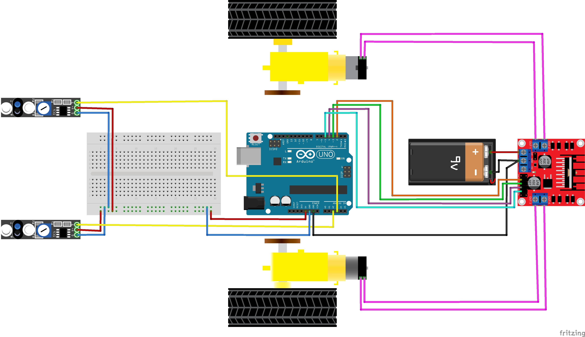
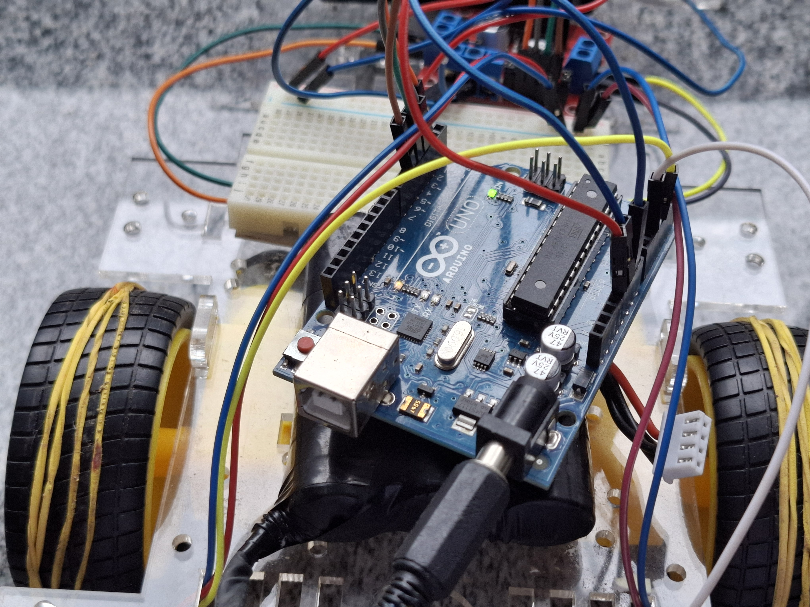
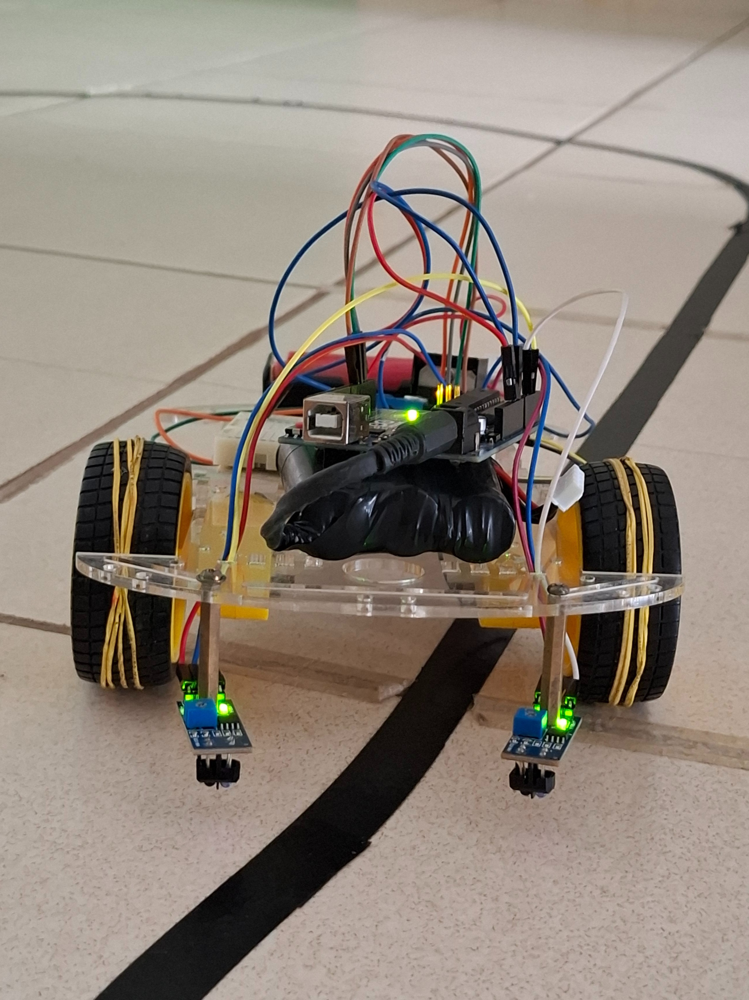
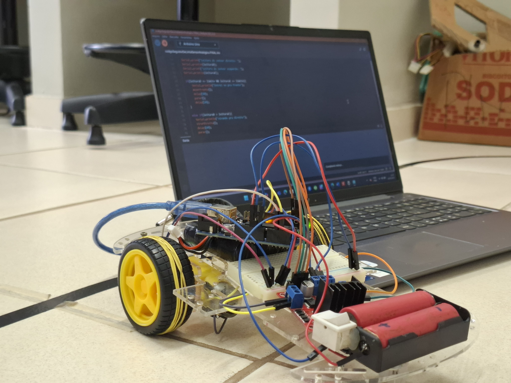

# Carrinho Seguidor de Linha Simples

Meu primeiro robô seguidor de linha! Um projeto feito com o que tinha disponível no laboratório, com muita curiosidade e raiva.

## 🛠 Componentes Utilizados
- 1 Arduino Uno
- 1 Ponte H dupla L298N
- 2 Sensores Infravermelhos de reflexão
- Kit Chassi com 2 rodas
- 2 Motores DC
- 1 Protoboard
- Jumpers (Macho/Fêmea e Macho/Macho)
- 2 Baterias (uma para o Arduino e outra para a Ponte H)
- Parafusos e espaçadores

## 🚀 Como funciona
O robô utiliza sensores de reflexão infravermelhos que emitem luz sobre a superfície e analisam o que é refletido de volta para detectar a linha preta. Esses dados são enviados ao Arduino, que atua como o "cérebro" do projeto, processando as informações e decidindo como ajustar o movimento.

O Arduino envia comandos para a ponte H, que controla a velocidade e o sentido de rotação de cada motor individualmente, permitindo que o carrinho corrija sua trajetória e mantenha-se centralizado na linha. Toda a parte de conexão de energia e dados entre os componentes é feita através de jumpers e uma protoboard, o que facilita a organização e a expansão do circuito sem a necessidade de soldas.

## 💻 Preview do Código
Aqui está o trecho da lógica principal que faz o robô seguir a linha. Para ver o arquivo completo, [clique aqui](src/codigoSeguidorDeLinhaSensorAnalogico-FINAL.ino).

```cpp
// Exemplo: Substitua pelo seu código real
void loop() {
  int sensorEsquerda = digitalRead(pinEsquerda);
  int sensorDireita = digitalRead(pinDireita);

  // Se ambos sensores detectarem branco, segue em frente
  if (sensorEsquerda == HIGH && sensorDireita == HIGH) {
    moverFrente();
  } 
  // Se o sensor da esquerda sair da linha, vira para a esquerda
  else if (sensorEsquerda == LOW) {
    virarEsquerda();
  }
  // Se o sensor da direita sair da linha, vira para a direita
  else if (sensorDireita == LOW) {
    virarDireita();
  }
}
```


## ⚡ Esquema Elétrico
Para visualizar as conexões entre o Arduino, sensores, motores e ponte H, veja o diagrama abaixo:



## 📸 Fotos e Vídeos
Aqui estão algumas fotos do meu carrinho seguidor de linha e o registro do projeto em funcionamento:

<div align="center">
<<<<<<< HEAD
  
  
  
=======
  
  
  
>>>>>>> 426e7320300dcc81f63175c0426c33c8e7d65e45
</div>

- **Vídeo do robô em funcionamento:** [Clique aqui para assistir no YouTube](https://www.youtube.com/watch?v=wgW3v_sQAcE)

## 📝 O que aprendi
- **Eletrônica aplicada:** Como integrar diferentes componentes (sensores, motores, ponte H) usando uma protoboard.
- **Lógica de sensores:** Como funciona a detecção de reflexão infravermelha para identificar superfícies escuras.
- **Controle de motores:** Como o Arduino utiliza a ponte H para controlar o sentido e a velocidade de rotação.
- **Montagem e organização:** A importância de manter o chassi equilibrado e a fiação organizada para não interferir no funcionamento.

## 📝 Documentação Original
Desenvolvemos um material completo para auxiliar na montagem e no entendimento do funcionamento do robô:
- [Clique aqui para ler a Apostila de Montagem (PDF)](src/manual%20de%20montagem%20do%20lesma.pdf)
